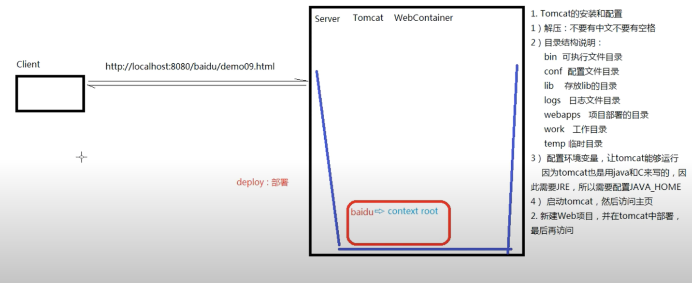
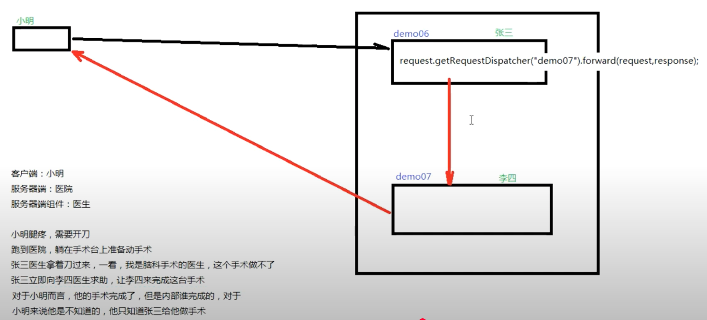
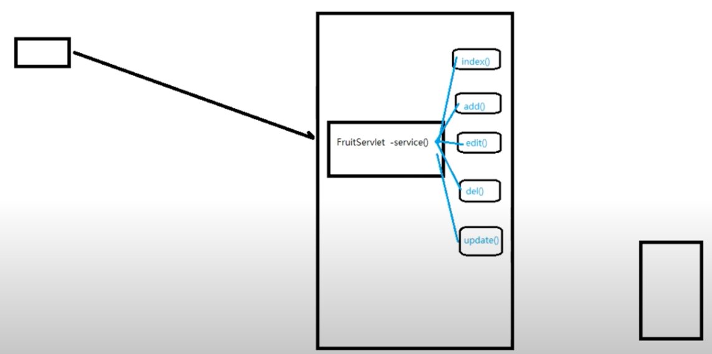

## 18 CS和BS的异同点


## 19 Tomcat新建项目 部署 运行 访问



## 20 在IDEA下新建javaweb项目 部署 运行

## 21 Servlet入门 获取参数

```sql
create
database fruitdb;
use
fruitdb;
CREATE TABLE t_fruit
(
    fid    INT PRIMARY KEY AUTO_INCREMENT,
    fname  VARCHAR(50),
    price  INT,
    fcount INT,
    remark VARCHAR(200)
);
```

- 404: 找不到对应的资源


## 22 Servlet review


## 23 Servlet处理请求参数中文乱码问题


## 24 Servlet继承关系以及service方法

### 2. Servlet的继承关系 - 重点查看的是服务方法(service())

1. 继承关系
    - javax.servlet.Servlet接口
        - javax.servlet.GenericServlet抽象类
            - javax.servlet.http.HttpServlet抽象子类

2. 相关方法
    - javax.servlet.Servlet接口:
        - void init(config) - 初始化方法
        - void service(request, response) - 服务方法
        - void destroy() - 销毁方法

    - javax.servlet.GenericServlet抽象类:
        - void service(request, response) - 仍然是抽象的

    - javax.servlet.http.HttpServlet抽象子类:
        - void service(request, response) - 不是抽象的

        1. String method = req.getMethod();
        2. 各种if判断，根据请求方式不同，决定去调用不同的do方法。
           
        3. 在HttpServlet这个抽象类中，do方法都差不多。
         ```java
         protected void doGet(HttpServletRequest req, HttpServletResponse resp)
            throws ServletException, IOException
         {
            String protocol = req.getProtocol();
            String msg = lStrings.getString("http.method_get_not_supported");
            if (protocol.endsWith("1.1")) {
               resp.sendError(HttpServletResponse.SC_METHOD_NOT_ALLOWED, msg);
            } else {
               resp.sendError(HttpServletResponse.SC_BAD_REQUEST, msg);
            }
         }
      ```
3. 小结
    1. 继承关系: HttpServlet -> GenericServlet -> Servlet
    2. Servlet中的核心方法: init()，service()，destroy()
    3. 服务方法: 当有请求过来时，service()方法会自动响应(其实是tomcat容器调用的)  
       在HttpServlet中我们会去分析请求的方式: 到底是get、post、head还是delete等等，  
       然后决定调用的是哪个do开头的方法。  
       那么在HttpServlet中这些do方法默认都是405的实现风格 - 要我们子类去实现对应的方法，否则默认会报405错误。
    4. 因此，我们在新建Servlet时，才会去考虑请求方法，从而决定重写哪个do方法。

## 25 Servlet的生命周期

### 3. Servlet的生命周期

1. 生命周期: 从出生到死亡的过程就是生命周期。对应Servlet中的三个方法: init()、service()、destroy()。
2. 默认情况下:
    - 第一次接受请求时，这个Servlet会进行实例化(调用构造方法)、初始化、然后服务。
    - 第二次请求开始，每一次都是服务。
    - 当容器关闭时，其中所有的Servlet实例都会被销毁，调用销毁方法。
3. 通过案例我们发现:
    - Servlet实例tomcat只会创建一个，所有的请求都是这个实例去响应。
    - 默认情况下，第一次请求时，tomcat才会去实例化，初始化，然后在服务。
    - 这样的好处是什么? 提高系统的启动速度。
    - 这样的缺点是什么? 第一次请求时，耗时较长。
    - 因此得出结论: 如果需要提高系统的启动速度，当前默认情况就是这样。
    - 如果需要提高响应速度，我们应该设置Servlet的初始化时机。
4. Servlet的初始化时机:
    - 默认是第一次接受请求时，实例化，初始化。
    - 我们可以通过<load-on-startup>来设置Servlet启动的先后顺序，数字越小，启动越靠前，最小值为0。
5. Servlet在容器中是: 单例的、线程不安全的。
    - 单例: 所有的请求都是同一个实例去响应。
    - 线程不安全: 一个线程需要根据这个实例中的某个成员变量值去做逻辑判断。但是在中间某个时机，  
      另一个线程改变了这个成员变量的值，从而导致第一个线程的执行路径发送了变化。
      
    - 我们已经知道了Servlet是线程不安全的，给我们的启发是: 尽量不要在Servlet中定义成员变量。
      如果不得不定义成员变量，那么不要去: 1️⃣修改成员变量的值 2️⃣根据成员变量的值做一些逻辑判断。

## 26 HTTP协议

### 4. HTTP协议

1. HTTP称之为`超文本传输协议`。
2. HTTP是无状态的。
3. HTTP请求响应包含两个部分: 请求和响应。
    - 请求:
        - 请求包含三个部分: 1. 请求行 2. 请求消息头 3. 请求主体
        - a. 请求行包含三个信息: 1. 请求的方式 2. 请求的URL 3. 请求的协议(一般都是HTTP1.1)
        - b. 请求消息头中包含了很多客户端需要告诉服务器的信息，比如: 我的浏览器型号、版本、我能接受的内容的类型、
          我给你发的内容的类型，内容的长度等等...
        - c. 请求体，三种情况:
            - get方式，没有请求体，但是有一个queryString
            - post方式，有请求体，form data
            - json方式，有请求体，request payload
    - 响应:
        - 响应也包含三个部分: 1. 响应行 2. 响应头 3. 响应体
        - a. 响应行包含三个信息: 1. 协议 2. 响应状态码 3. 响应状态
        - b. 响应头: 包含了服务器的信息，服务器发送给浏览器的信息(内容的媒体类型、编码、内容长度等)。
        - c. 响应体: 响应的实际内容(比如请求add.html页面时，响应的内容就是<html><head><body><form>...)

## 27 session会话跟踪技术

### 5. 会话

1. HTTP是无状态的。
    - HTTP无状态: 服务器无法判断这两次请求是同一个客户端发过来的，还是不同的客户端发过来的。
    - 无状态带来的现实问题: 第一次请求是添加商品到购物车，第二次请求是结账。如果这两次请求服务器无法区分是同一个用户的，那么就会导致混乱。
    - 通过会话跟踪技术来解决无状态的问题。
      

2. 会话跟踪技术
    - 客户端第一次发请求给服务器，服务器获取session，获取不到，则创建新的，然后响应给客户端。
    - 下次客户端给服务器发请求时，会把sessionID带给服务器，那么服务器就能获取到了，那么服务器就判断这一次请求和上次某次请求是同一个客户端，从而能够区分开客户端。
    - 常用到API:
        - `request.getSession()` -> 获取当前的会话，如果没有则创建一个新的会话
        - `request.getSession(true)` -> 效果和不带参数相同
        - `request.getSession(false)` -> 获取当前会话，没有则返回null，不会创建新的

        - `session.getId()` -> 获取sessionID
        - `session.isNew()` -> 判断当前session是否是新的
        - `session.getMaxInactiveInterval()` -> session的非激活间隔时长(默认1800秒)
        - `session.setMaxInactiveInterval()` -> 设置非激活间隔时长
        - `session.invalidate()` -> 强制性让会话立即失效

## 28 session保存作用域

3. session保存作用域
   
    - session保存作用域是和具体的某一个session对应的
    - 常用的API:
        - void session.setAttribute(k, v)
        - Object session.getAttribute(k)
        - void session.removeAttribute(k)

## 29 服务器端转发和客户端重定向

### 6. 服务器内部转发以及客户端重定向

- 服务器内部转发: `request.getRequestDispatcher("...").forward(request, response)`
    - 一次请求响应的过程，对于客户端而言，内部经过了多少次转发，客户端是不知道的。
    - 地址栏没有变化
      
- 客户端重定向: `response.sendRedirect("...")`
    - 两次请求响应的过程，客户端肯定知道，请求URL有变化。
    - 地址栏有变化
      

## 30 Thymeleaf快速入门

## 31 Thymeleaf渲染index页面

### 7. Thymeleaf - 视图模板技术

1. 添加Thymeleaf的依赖。
2. 新建一个Servlet类`ViewBaseServlet`。
3. 在`web.xml`文件中添加配置。
    - 配置前缀 view-prefix
    - 配置后缀 view-suffix
4. 使我们的Servlet继承`ViewBaseServlet`。
5. 根据`逻辑视图名称`得到`物理视图名称`。

```java
// 此处的视图名称是index
// 那么Thymeleaf会将这个 逻辑视图名称 对应到 物理视图名称 上去
// 逻辑视图名称: index
// 物理视图名称: view-prefix + 逻辑视图名称 + view-suffix
// 所以真实的视图名称是: /         index        .html
```

6. 使用Thymeleaf的标签
    - `th:if`, `th:unless`, `th:each`, `th:text`

## 32 Thymeleaf review

review:

1. post提交方式下的设置编码，防止中文乱码  
   request.setCharacterEncoding("utf-8");  
   get提交方式，tomcat8开始，编码不需要设置  
   tomcat8之前，get方式设置比较麻烦：

   ```java
   String fname = request.getParameter("fname");
   byte[] bytes = fname.getBytes("iso-8859-1");
   fname = new String(bytes, "UTF-8");
   ```
2. Servlet继承关系以及生命周期
    1) Servlet接口 ： init() , service() , destroy()  
       GenericServlet抽象子类： abstract service();  
       HttpServlet抽象子类：实现了service方法，在service方法内部通过request.getMethod()来判断请求的方式，  
       然后根据请求的方式去调用内部的do方法。每一个do方法进行了简单实现，主要是如果请求方式不符合，则报405错误。  
       目的是让我们的Servlet子类去重写对应的方法（如果重写的不对，则使用父类的405错误实现）
    2) 生命周期: 实例化、初始化、服务、销毁
        - Tomcat负责维护Servlet实例的生命周期
        - 每个Servlet在Tomcat容器中只有一个实例，它是线程不安全的
        - Servlet的启动时机: <load-on-startup>
        - Servlet3.0开始支持注解: @WebServlet

3. HTTP协议：
    1) 由`Request`和`Response`两部分组成
    2) 请求包含了三部分: 请求行、请求消息头、请求主体: 普通的get方式请求-query string; post方式- form data; json格式 -
       request payload
    3) 响应包含了三部分: 响应行、响应消息头、响应主体

4. HttpSession
    1) HttpSession: 表示`会话`
    2) 为什么需要HttpSession， 原因是因为Http协议是无状态的
    3) Session保存作用域: 一次会话范围都有效; `void session.setAttribute(k,v)`, `Object session.getAttribute(k)`
    4) 其他的API: `session.getId()`，`session.isNew()`， `session.getCreationTime()`， `session.invalidate()`等等

5. 服务器端转发和客户端重定向
    1) 服务器端转发: `request.getRequestDispatcher("index.html").forward(request,response);`
    2) 客户端重定向: `response.sendRedirect("index.html");`

6. Thymeleaf的部分标签
    1) 使用步骤: 添加jar，新建ViewBaseServlet(有两个方法)， 配置两个`<context-param>`: `view-prefix`, `view-suffix`
    2) 部分标签: `<th:if>`, `<th:unless>`, `<th:each>`, `<th:text>`

今日内容：

1. 保存作用域
   原始情况下，保存作用域我们可以认为有四个: page(页面级别，现在几乎不用)，request(一次请求响应范围)，
   session(一次会话范围)，application(整个应用程序范围)
    1) request：一次请求响应范围
       
    2) session：一次会话范围有效
       
    3) application： 一次应用程序范围有效
       

2. 路径问题
    1) 相对路径
    2) 绝对路径
       

3. 实现库存系统的功能

## 40 MVC Servlet优化1




> 200: 正常响应  
> 404: 找不到资源  
> 405: 请求方式不支持  
> 500: 服务器内部错误

## 45 MVC Review

1. 最初的做法是: 一个请求对应一个Servlet，这样存在的问题是Servlet太多了。
2. 把一系列的请求都对应一个Servlet，IndexServlet/AddServlet/EditServlet/DelServlet/UpdateServlet -> 合并成FruitServlet
   通过一个operate的值来决定调用FruitServlet中的那一个方法
   使用`switch-case`
3. 在一个版本中，Servlet中充斥着大量的`switch-case`，试想一下，随着我们的项目的业务规模扩大，  
   会有很多的Servlet，也就意味着会有很多的`switch-case`，这是一种代码冗余。
   因此在Servlet中使用了反射技术，我们规定operate的值和方法名一致，  
   那么接受到operate的值是什么就表明我们需要调用对应的方法。
   如果找不到对应的方法，则抛异常。
4. 在上一个版本中我们使用了反射技术，但是其实还是存在一定的问题。  
   每一个Servlet中都有类似的反射技术的代码。因此继续抽取，设计了中央控制器类: `DispatcherServlet`。
   `DispatcherServlet`这个类的工作分为两大部分:
    1) 根据url定位到能够处理这个请求的Controller组件:
        1) 从url中提取servletPath: /fruit.do -> fruit。
        2) 根据fruit找到对应的组件: FruitController，这个映射关系保存在`applicationContext.xml`中。
       ```
       <bean id="fruit" class="com.atguigu.fruit.controllers.FruitController" />
       ```
       通过DOM技术解析XML文件，在中央控制器中形成一个beanMap容器，用来存放所有的Controller组件。
        3) 根据获取到的operate的值定位到FruitController中需要调用的方法。

    2) 调用Controller组件中的方法
        1) 获取参数  
           获取即将要调用的方法的参数签名信息: `Parameter[] parameters = method.getParameters();`  
           通过`parameter.getName()`获取参数的名称; 通过`parameter.getType()`获取参数的类型。  
           准备了`Object[] parameterValues` 这个数组用来存放对应参数的值。  
           另外，需要参数的类型问题，需要做类型转换的工作。通过`parameter.getType()`获取参数类型。
        2) 执行方法
           `Object returnObj = method.invoke(controlllerBean, parameterValues);`
        3) 视图处理

## 46 Servlet API

今日内容:

1. 再次学习Servlet的初始化方法
    1) Servlet生命周期: 实例化、初始化、服务、销毁
    2) Servlet中初始化方法有两个: init()、init(config)
       其中带参数的方法代码如下:
       ```java
       public void init(ServletConfig config) throws ServletException {
           this.config = config;
           init();
       }
       ```
       另外一个无参的init方法如下:
       ```java
       public void init() throws ServletException {
       }
       ```
       如果我们想要在Servlet初始化时做一些准备工作，那么可以重写`init()`方法。
       我们可以通过如下步骤去获取初始化设置的数据
        - 获取config对象: `ServletConfig config = getServletConfig();`
        - 获取初始化参数值: `config.getInitParameter(key)`
    3) 在web.xml文件中配置Servlet
    ```xml
    <servlet>
        <servlet-name>Demo01Servlet</servlet-name>
        <servlet-class>com.atguigu.servlet.Demo01Servlet</servlet-class>
        <init-param>
            <param-name>hello</param-name>
            <param-value>world</param-value>
        </init-param>
    </servlet>
    <servlet-mapping>
        <servlet-name>Demo01Servlet</servlet-name>
        <url-pattern>/demo01</url-pattern>
    </servlet-mapping>
    ```
    4) 也可以通过注解的方式进行配置
    ```java
    @WebServlet(urlPatterns = {"/demo01"},
    initParams = {@WebInitParam(name = "hello", value = "world_annotation"),
    @WebInitParam(name = "uname", value = "jim")})
    ```
2. 学习Servlet中的ServletContext和<context-param>
    1) 获取ServletContext
        - 在初始化方法中: `ServletContext servletContext = getServletContext();`。
        - 在服务方法中也可以通过request对象获取，也可以通过session获取。
    2) 获取初始化值:
        - `servletContext.getInitParameter();`
3. 什么是业务层
    1) Model1和Model2
       
       
        - MVC: Model(模型)、View(视图)、Controller(控制器)
        - 视图层: 用于做数据展示以及和用户交互的一个界面
        - 控制层: 能够接收客户端的请求，具体的业务功能还是需要借助于模型组件来完成
        - 模型层: 模型分为很多种，有比较简单的POJO/VO(Value Object)，有业务模型组件，有数据访问层组件
            - POJO/VO: 值对象
            - DAO: 数据访问对象
            - BO(Business Object): 业务对象
        - 区分业务对象和数据访问对象
            1) DAO中的方法都是单精度方法，或者称为细粒度方法。什么叫单精度？一个方法只考虑一个操作。比如添加就是`insert`
               、查询就是`select`操作...
            2) BO中的方法属于业务方法，而实际的业务是比较复杂的，因此业务方法的粒度是比较粗的。  
               注册这个功能属于业务功能，也就是说注册这个方法属于业务方法。  
               那么这个业务方法中包含了多个DAO方法。
               也就是说注册这个业务功能需要通过多个DAO方法组合调用，从而完成注册功能。  
               注册:
                1. 检查用户名是否已经被注册 - DAO中的`select`操作。
                2. 向用户表新增一条新的用户记录 - DAO中的`insert`操作。
                3. 向用户积分表新增一条记录(新用户默认初始化积分为100分) - DAO中的`insert`操作。
                4. 向系统消息表新增一条记录(某某新用户注册了，需要根据通讯录信息向他的联系人推送消息) - DAO中的`insert`
                   操作。
                5. 向系统日志表新增一条记录(某用户使用某IP在某年某月某日某时某分某秒某毫秒注册) - DAO中的`insert`操作。
                6. ...
            3) 在库存系统中添加业务层组件
4. IOC
5. 过滤器
6. 事务管理
7. TransactionManager、ThreadLocal、OpenSessionInViewFilter

