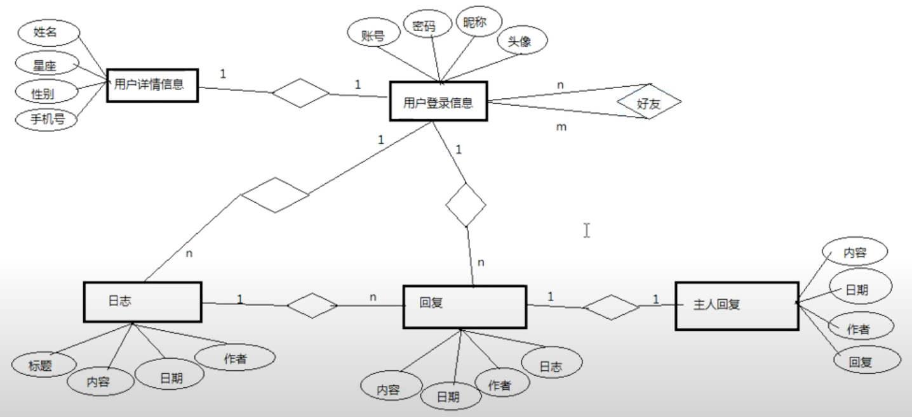

1. 熟悉QQZone业务需求
    1) 用户登录
    2) 登录成功，显示主界面。左侧显示好友列表；上端显示欢迎词。如果不是自己的空间，显示超链接: 返回自己的空间；下端显示日志列表。
    3) 查看日志详情:
        1) 日志本身的信息(作者头像、昵称、日志标题、日志内容、日志的日期)
        2) 回复列表(回复者的头像、昵称、回复内容、回复日期)
        3) 主人回复信息
    4) 删除日志
    5) 删除特定回复
    6) 删除特定主人回复
    7) 添加日志、添加回复、添加主人回复
    8) 点击左侧好友链接，进入好友的空间
2. 数据库的设计
    1) 抽取实体: 用户登录信息、用户详情信息、日志、回帖、主人回复
    2) 分析其中的属性
        - 用户登录信息: 账户、密码、头像、昵称
        - 用户详情信息: 真实姓名、星座、血型、邮箱、手机号...
        - 日志: 标题、内容、日期、作者
        - 回复: 内容、日期、作者、日志
        - 主人回复: 内容、日期、作者、回复
    3) 分析实体之间的关系
        - 用户登录信息 : 用户详情信息 1:1 PK
        - 用户 : 日志 1:N
        - 日志 : 回复 1:N
        - 回复 : 主人回复 1:1 UK
        - 用户 : 好友 N:N

3. 数据库的范式
    1) 第一范式: 列不可再分。
    2) 第二范式: 一张表只表达一层含义(只描述一件事情)。
    3) 第三范式: 表中的每一列和主键都是直接依赖关系，而不是间接依赖。

4. 数据库设计的范式和数据库的查询性能很多时候是相悖的，我们需要根据实际的业务情况做一个选择:
    - 查询频次不高的情况下，我们更倾向于提高数据库的设计范式，从而提高存储效率
    - 查询频次较高的情形，我们更倾向于牺牲数据库的规范度，降低数据库设计的范式，允许特定的冗余，从而提高查询的性能。

